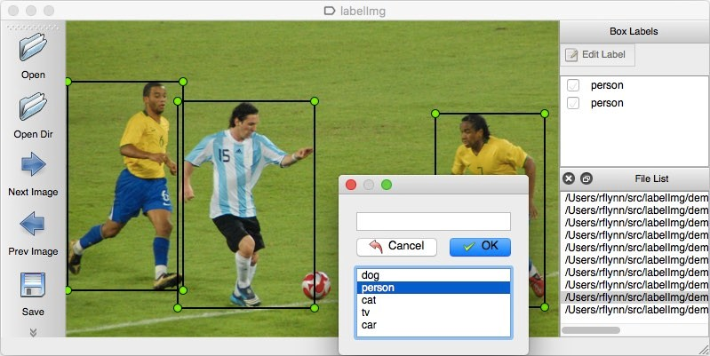
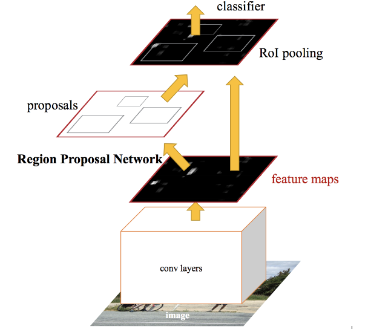
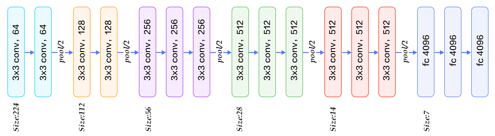
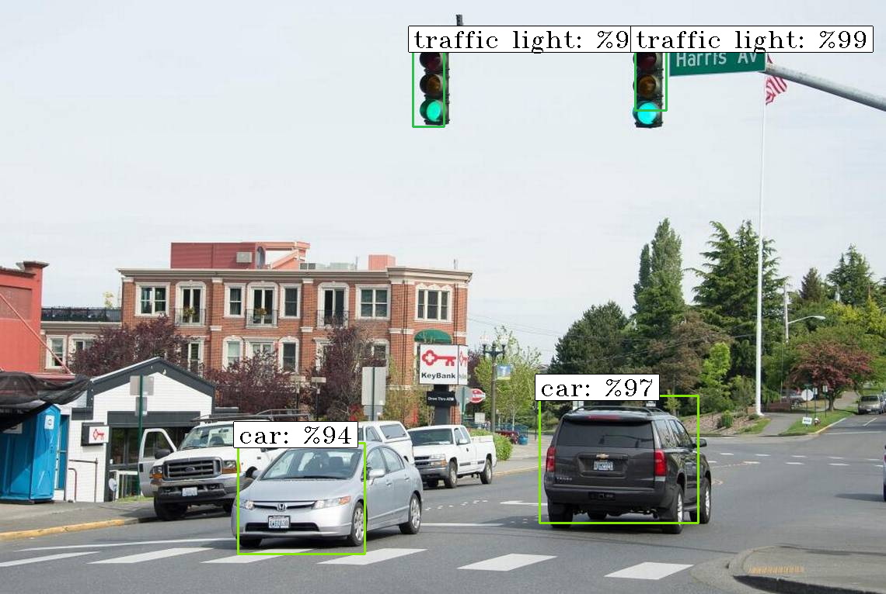
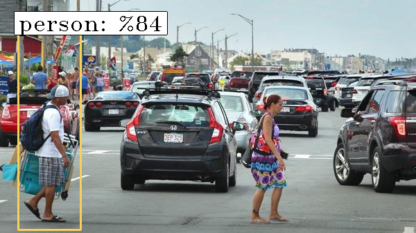

`# Nesne Tespiti

```
Muhammed Pektaş 141220024 , Cevher Söylemez 14122004
Ders: Bilgisayarlı Görmeye Giriş^
```
**ÖZET**
Bu çalışmanın teması otonom araçlar olarak seçilmiştir. Bu tema doğrultusunda trafik lambası, insan ve araç
tespiti üzerinde çalışılmıştır. Çalışmada kullanılan algoritma faster-RCNN olarak seçilmiştir.

## 1. GİRİŞ

Yapay Zeka ve görüntü işlemedeki gelişmeler ile otonom araçlar günümüzde oldukça
popüler olmuşlardır. Bu araçların en önemli görevleri arasında yoldaki yaya, araç ve trafik
ışıklarını tespit etmek yer almaktadır. Bu çalışmada bu 3 nesnenin çalışması için bir model
eğitilmiş ve başarılı sonuçlar elde edilmiştir.

## 2. MATERYAL VE YÖNTEM

Çalışmada kullanılacak olan nesne tespiti yapabilen modelin eğitilmesi için güçlü
donanımlara ihtiyaç vardır. Bu donanımlar çok maliyetli olduğundan bu çalışma için ücretsiz bulut
hizmetleri kullanılması gerekmedir. Bu doğrultuda kullanılan bulut hizmeti Google Colabratory
olarak seçildi. Google Colabratory 12 saat boyunca kesintisiz model eğitebileceğiniz bir
platformdur. Google Drive ile beraber çalışabilme yeteneğine sahiptir. Donanım olarak TPU ve
GPU seçenlerini kullanıcılara sunmaktadır. Bu çalışmada Tesla K80 ekran kartı kullanılmıştır.[ 1 ]

Eğitim için etiketli verilerden oluşan bir veri kümesi oluşturulmalıdır. Bizim çalışmamız
boyunca seçilen 3 adet sınıf için 42 adet resim kullanılmıştır. Bu 42 adet resim içinde 199 adet
nesne etiketlenmiştir. Etiketleme işlemi için Şekil deki ekran görüntüsüne sahip labelmg yazılımı
kullanılmıştır.[2]


```
Şekil 1 - Etiketleme Yazılımı Ekran Görüntüsü
```

```
Etiketlenen veri kümesine bazı görüntüler Şekil 2’de verilmiştir.
```


```
Şekil 2 - Veri Kümesinden Bazı Örnekler
```
Eğitim için Faster-RCNN kullanılmıştır. Bu model diğer RCNN modellerine kıyasla en
hızlı tahmin işlemini gerçekleştiren modeldir.

```
ALGORİTMA TAHMİN SÜRESİ
RCNN 40 - 50 saniye
Fast RCNN 2 saniye^
Faster RCNN 0.2 saniye
Tablo 1 - RCNN Algoritmarı Tahmin Sürelerine Göre Karşılaştırmaları[3]
```
RCNN modellerinin karşılaştırması Tablo 1’de gösterilmektedir. Tablodan da görüleceği
üzere tahmin süresi bakımından önemli bir gelişme kaydedilmiştir. Faster RCNN’in çalışma
aşamaları Şekil 3’de gösterilmiştir.



```
Şekil 3 - Faster RCNN yaklaşımı[4]
```

Şekil 3’deki gösterimde bahsedilen **_“conv layers”_** derin öğrenme çalışan kişilerin
yakından tanıyacağı konvulüsyon katmanıdır. Bu katman sonucunda elde edilen özellikler
**_“Regional Proposal Network’e”_** girdi olarak verilir. Bu ağ yapısı girdi olarak aldığı özellik
haritasından çıktı olarak nesnelerin bulunabileceği bölgeleri verir. Nesne olduğu düşünülen bu
bölgeler bir sınıflandırıcı yardımıyla sınıflandırılarak nesnenin olası yeri ve hangi nesne olduğu
belirlenmiş olur. Faster RCNN kabaca bu şekilde çalışır.

Sınıflandırıcı olarak VGG16 derin öğrenme modeli seçilmiştir. [5] Bu modelin yapısı
Şekil 4’te verilmiştir.



```
Şekil 4 - VGG16 Mimarisi [6]
```
Yapılan bu ön hazırlıklar ve parametre ayarlamalarından sonra imkanlar dahilinde yaklaşık 10-
12 saat boyunca model 35 epoch eğitmiştir.

3. **SONUÇLAR VE TARTIŞMA**

Eğitim çok başarılı sonuçlar elde etmek için yeterli değildir. Ancak elde edilen sonuçlar görüleceği
üzere azımsanmayacak derece bir başarı söz konusudur. 35 epoch’luk eğitim sonucunda elde
edilen hata metriklerinin değerleri tablo 2’ de verilmiştir.

```
RPN’den gelen bölgelerin sınıflandırma
doğruluğu
```

```
RPN sınıflandırıcı hatası 0.
RPN regresyon hatası 0.
Tespit edici sınıflandırma hatası 0.
Tespit edici regresyon hatası 0.
Toplam Hata 0.
Tablo 2 - Hatalar Tablosu
```
Çalışmanın sonucu Şekil 5 ve Şekil 6’da gösterilmiştir.


Şekil 5 - Örnek Çıktı 1



```
Şekil 6 - Örnek Çıktı
```

### KAYNAKLAR

[1] Google, Erişim Tarihi: 29.05.2019, https://colab.research.google.com

[2] Tzutalin, D., (2017), Erişim Tarihi: 26.05.2019, https://github.com/tzutalin/labelImg

[3] Sharma, P. (2018) Erişim Tarihi: 2 8 .05.2019,
https://www.analyticsvidhya.com/blog/2018/10/a-step-by-step-introduction-to-the-basic-object-
detection-algorithms-part-1/
[4] Sharma, P. (2018) Erişim Tarihi: 28.05.2019,
https://www.analyticsvidhya.com/blog/2018/11/implementation-faster-r-cnn-python-object-
detection/
[5] Hassan, M. (2018), Erişim Tarihi: 21.05.2019, https://neurohive.io/en/popular-
networks/vgg16/
[6] Nanda, Y. (2018), Erişim Tarihi: 29.05.2019, https://www.quora.com/What-is-the-VGG-
neural-network


`